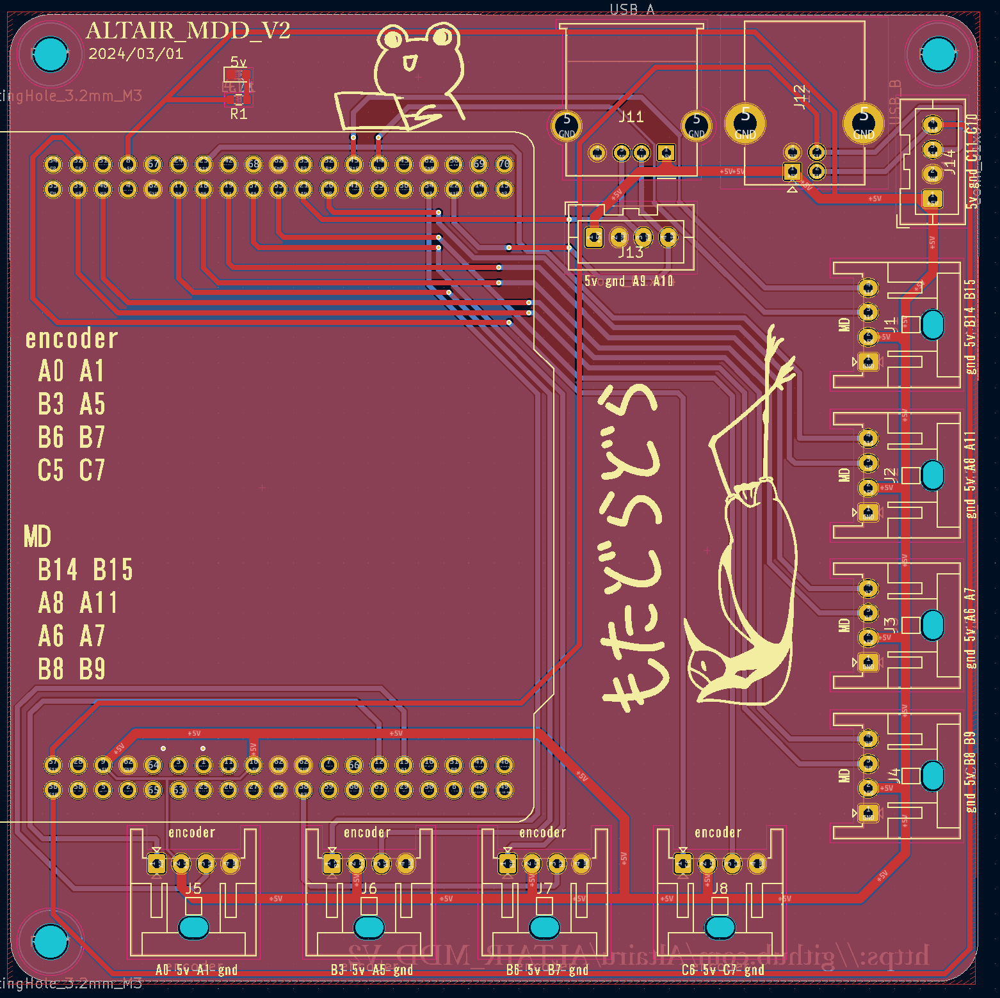
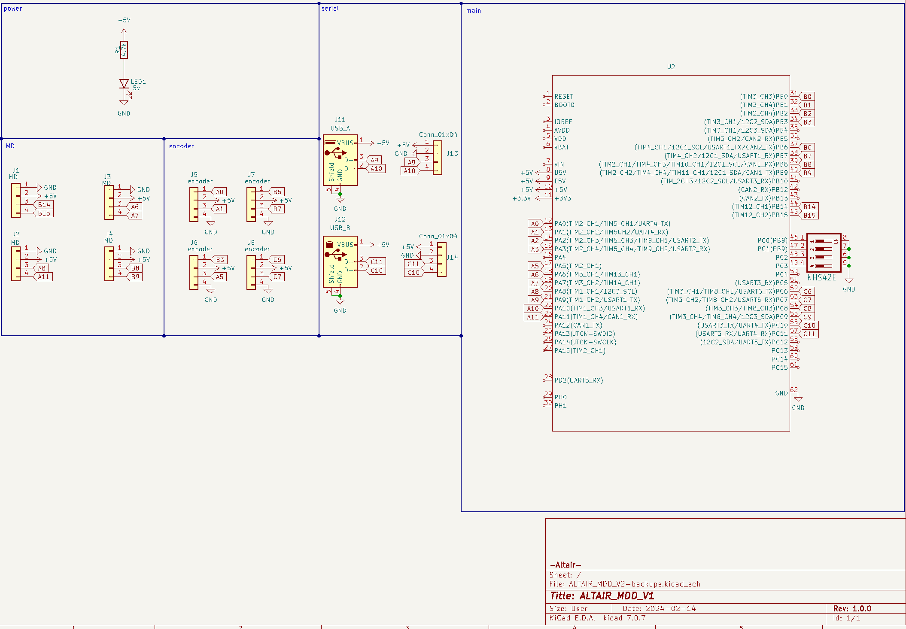

# ALTAIR_MDD_V2
[ALTAIR_MDD_V2](https://github.com/Altairu/ALTAIR_MDD_V2)

> encoder
 * A0 A1 TIMER5
 * B3 A5 TIMER2
 * B6 B7 TIMER4
 * C6 C7 TIMER3

> MD
 * B14(TIMER8  CH2)     B15(TIMER8  CH3)
 * A8(TIMER1  CH1)     A11(TIMER1  CH2)
 * A6(TIMER13 CH1)     A7(TIMER14 CH1)
 * B8(TIMER10 CH1)     B9(TIMER11 CH1)

> Serial
* tx:C10  rx:C11  SERIAL3  baudrate 115200

## 回路図

## PCB

