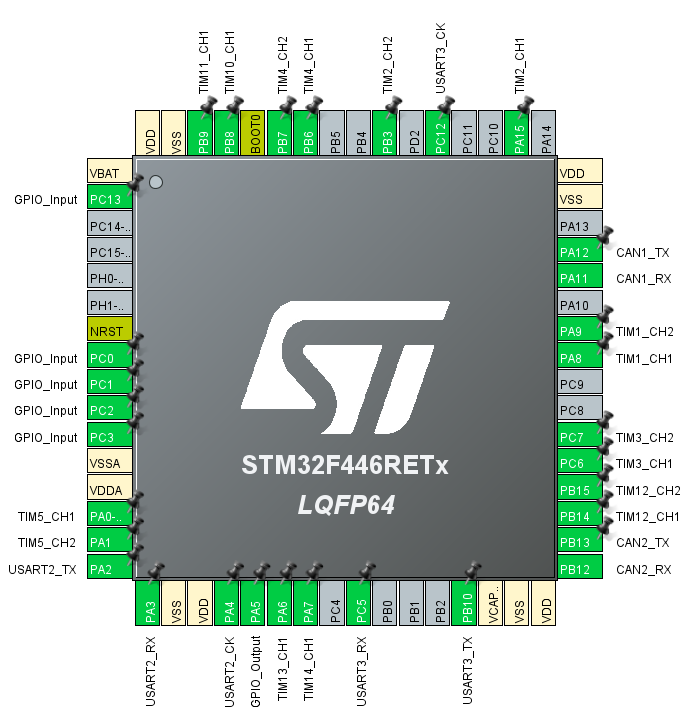

# ALTAIR_MDD_V3
[ALTAIR_MDD_V3](https://github.com/Altairu/ALTAIR_MDD_V3)

> encoder
 * A0 A1 TIMER5
 * B3 A15 TIMER2
 * B6 B7 TIMER4
 * C6 C7 TIMER3

> MD
 * B14(TIMER12 CH1) B15(TIMER12 CH2)
 * A8(TIMER1  CH1)     A9(TIMER1  CH2)
 * A6(TIMER13 CH1)     A7(TIMER14 CH1)
 * B8(TIMER10 CH1)     B9(TIMER11 CH1)

> limit switch
 * C0
 * C1
 * C2
 * C3

> Serial
* tx:A2  rx:A3  SERIAL2 
* tx:B10  rx:C5  SERIAL3

> CAN
* tx:A12  rx:A11  CAN1
* tx:B13  rx:B12  CAN2

## 回路図

## PCB

