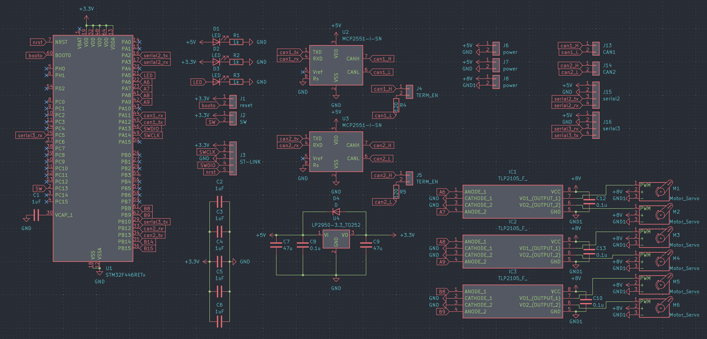
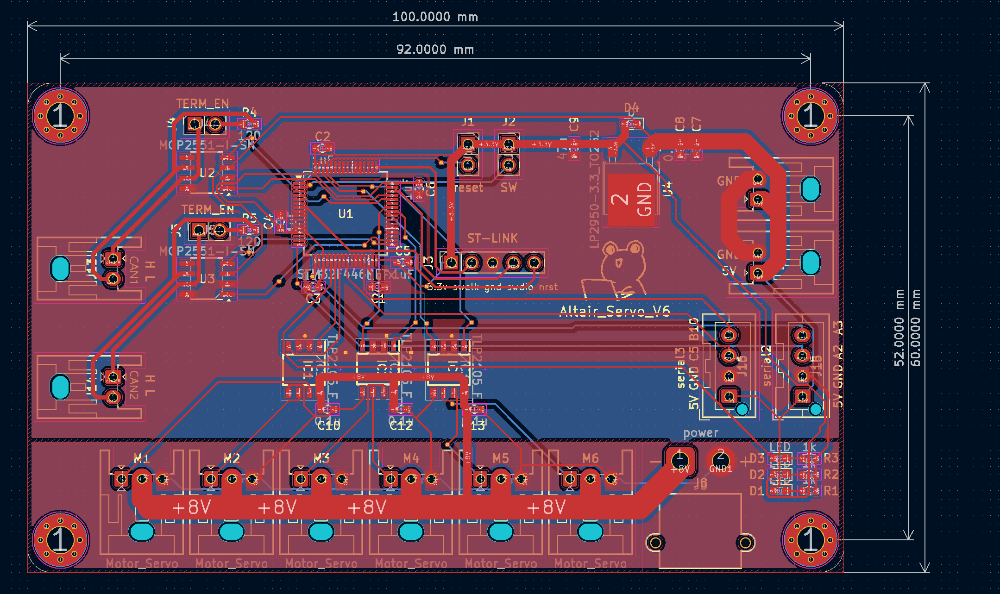

# ALTAIR_SERVO_MODULE_V6
[ALTAIR_SERVO_MODULE_V6](https://github.com/Altairu/ALTAIR_SERVO_MODULE_V6)

> servo
 * A6
 * A7
 * A8
 * A9
 * B8
 * B9

> Serial
* tx:A2  rx:A3  SERIAL2 
* tx:B10  rx:C5  SERIAL3

> CAN
* tx:A12  rx:A11  CAN1
* tx:B13  rx:B12  CAN2

## 回路図

## 実態配線図
