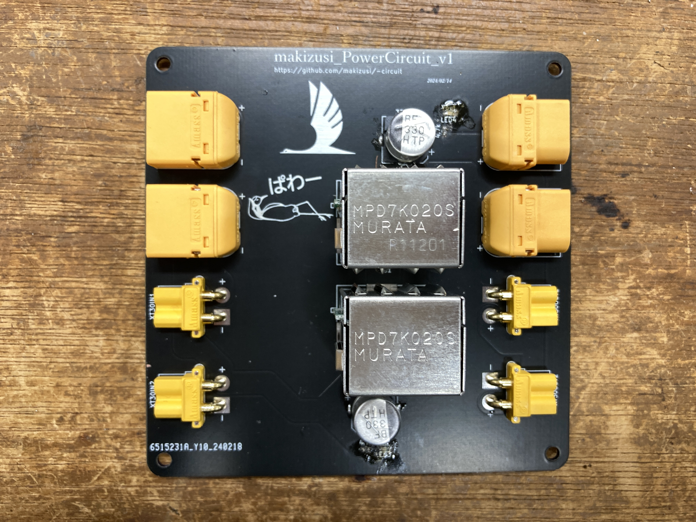
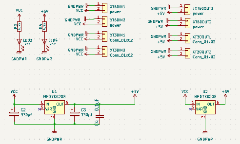
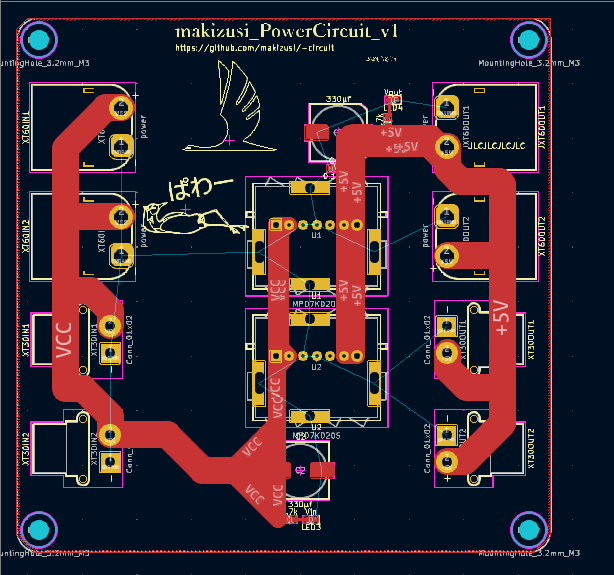

<<<<<<< HEAD
# **電源モジュール**

左が入力，右が出力

---
## sch

## pcb

=======
# **電源モジュール**

左が入力，右が出力

回路図は以下のフォルダに
https://github.com/makizusi/-circuit

---
## sch

## pcb

>>>>>>> 0de81ad8b7e1fb9163a581ec05500b8961d954d9
